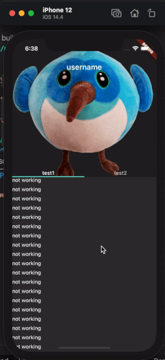

# custom_nested_scroll_view

A NestedScrollView that supports outer scroller to top overscroll.

## 🌍 Preview

Web demo 👉   [Click Here](https://killer-1255480117.cos.ap-chongqing.myqcloud.com/web/scrollMaster/index.html)

## 🐛 Problem

### NestedScrollView with pinned and stretch SliverAppBar

**Problem: NestedScrollView does not support outer scroller to top overscroll, so its SliverAppBar cannot be stretched.**

*Related issue: [https://github.com/flutter/flutter/issues/54059](https://github.com/flutter/flutter/issues/54059)*



## ⚡️ Solution

Fixed by:

1. Override the applyUserOffset method of _NestedScrollCoordinator to allow over-scroll the top of _outerPosition.

2. Override the unnestOffset, nestOffset, _getMetrics methods of _NestedScrollCoordinator to fix the mapping between _innerPosition and _outerPosition to _NestedScrollPosition (Coordinator).

*For more information, see:*

* `example/lib/main.dart`
* `lib/src/custom_nested_scroll_view.dart`

## 💡 Usage

```shell
dependencies:  
  ...  
  custom_nested_scroll_view:
    git:
      url: https://github.com/idootop/custom_nested_scroll_view.git
```

```dart
import 'package:flutter/material.dart';
import 'package:custom_nested_scroll_view/custom_nested_scroll_view.dart';

void main() => runApp(MyApp());

class MyApp extends StatelessWidget {
  @override
  Widget build(BuildContext context) {
    return MaterialApp(
      title: 'Example',
      home: Home(),
    );
  }
}

class Home extends StatelessWidget {
  @override
  Widget build(BuildContext context) {
    return DefaultTabController(
      length: 2,
      child: Scaffold(
        body: CustomNestedScrollView(
          physics: BouncingScrollPhysics(),
          overscrollType: CustomOverscroll.outer,
          headerSliverBuilder: (context, outerScrolled) => <Widget>[
            CustomSliverOverlapAbsorber(
              overscrollType: CustomOverscroll.outer,
              handle: CustomNestedScrollView.sliverOverlapAbsorberHandleFor(context),
              sliver: SliverAppBar(
                pinned: true,
                stretch: true,
                expandedHeight: 400,
                flexibleSpace: FlexibleSpaceBar(
                  centerTitle: true,
                  title: Center(child: Text('Example')),
                  background: Image.network(
                    'https://pic1.zhimg.com/80/v2-fc35089cfe6c50f97324c98f963930c9_720w.jpg',
                    fit: BoxFit.cover,
                  ),
                ),
                bottom: TabBar(
                  tabs: [
                    Tab(child: Text('Tab1')),
                    Tab(child: Text('Tab1')),
                  ],
                ),
              ),
            ),
          ],
          body: TabBarView(
            children: [
              CustomScrollView(
                slivers: <Widget>[
                  Builder(
                    builder: (context) => CustomSliverOverlapInjector(
                      overscrollType: CustomOverscroll.outer,
                      handle: CustomNestedScrollView.sliverOverlapAbsorberHandleFor(context),
                    ),
                  ),
                  SliverFixedExtentList(
                    delegate: SliverChildBuilderDelegate(
                      (_, index) => ListTile(
                        key: Key('$index'),
                        title: Center(
                          child: Text('ListTile ${index + 1}'),
                        ),
                      ),
                      childCount: 30,
                    ),
                    itemExtent: 50,
                  ),
                ],
              ),
              Center(
                child: Text('Test'),
              ),
            ],
          ),
        ),
      ),
    );
  }
}
```

## ❤️ Acknowledgements

Thanks to [fluttercandies](https://github.com/fluttercandies)'s [extended_nested_scroll_view](https://github.com/fluttercandies/extended_nested_scroll_view).

## 📖 References

* [大道至简：Flutter嵌套滑动冲突解决之路](http://vimerzhao.top/posts/flutter-nested-scroll-conflict/)
* [深入进阶-如何解决Flutter上的滑动冲突？ ](https://juejin.cn/post/6900751363173515278)
* [用Flutter实现58App的首页](https://blog.csdn.net/weixin_39891694/article/details/111217123)
* [不一样角度带你了解 Flutter 中的滑动列表实现](https://blog.csdn.net/ZuoYueLiang/article/details/116245138)
* [Flutter 滑动体系 ](https://juejin.cn/post/6983338779415150628)
